# Diagramas — Backend desde POO

Código Mermaid de las figuras declaradas como `diagrama` en
[`FIGURAS.md`](FIGURAS.md). Un bloque por figura, encabezado por su número.

Se rinden a imagen antes de insertarlos en el `.docx`: el manuscrito Word no
lleva Mermaid.

---

## Figura 1.1 — Del proceso por petición al bucle de eventos

Cada nodo lleva su costo anotado. El problema C10K va marcado como el punto donde
el modelo del medio deja de alcanzar.

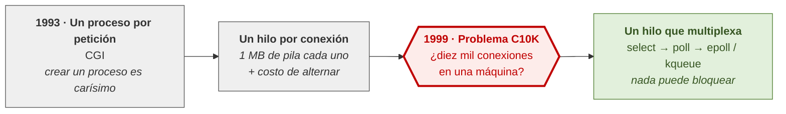

## Figura 1.2 — El recorrido de una petición del lado del servidor

Lo que la figura tiene que dejar claro: **la validación ocurre antes del handler**,
y por eso adentro del handler los datos ya son confiables.

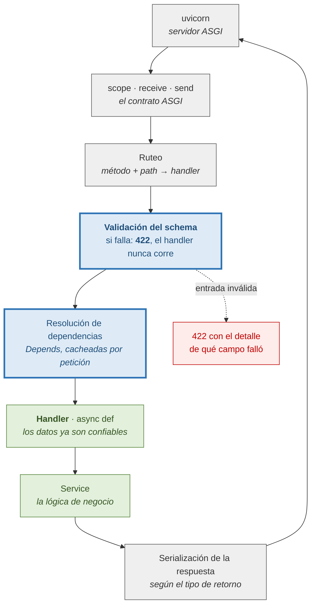

## Figura 1.3 — Las capas y la dirección de las dependencias

La capa Task va al costado, no abajo: **es otro cliente de Service, no una capa
nueva.** Los puertos aparecen aparte, marcados como adaptadores.

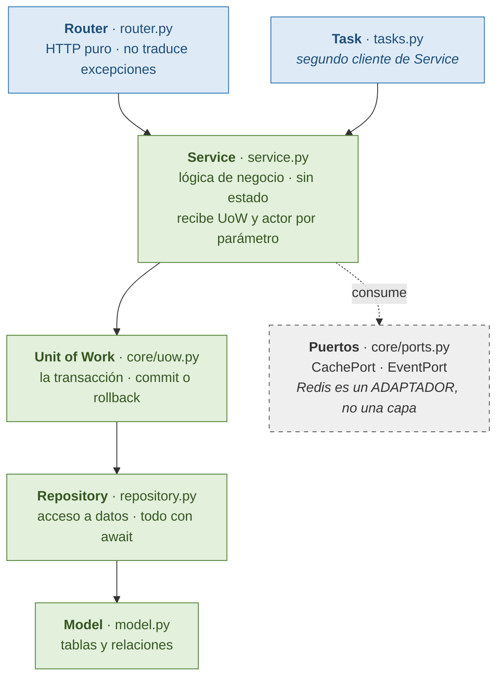

## Figura 1.4 — Los ocho servicios y su orden de arranque

El scheduler va marcado con "exactamente 1" —dos instancias encolan cada tarea dos
veces— y Postgres y Redis en distinto color según si su caída detiene o degrada.

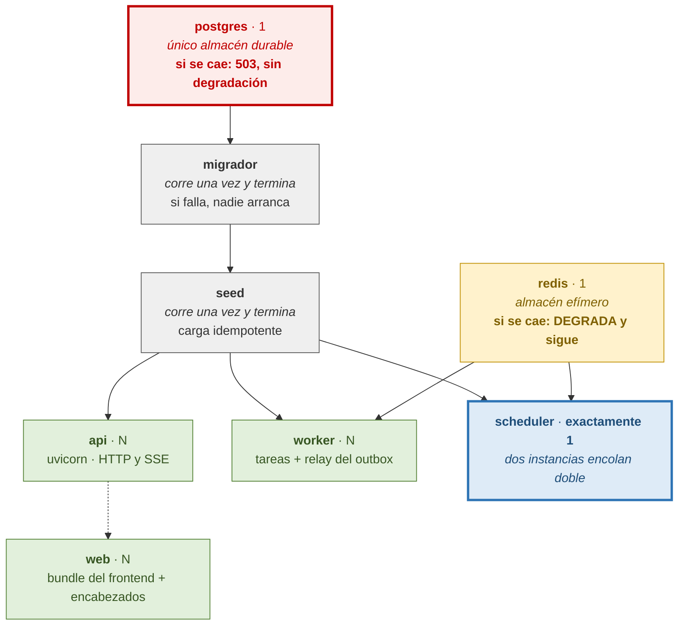

## Figura 2.1 — Del contrato generado al contrato derivado

El eje de la figura es **qué resignó cada etapa**, no la cronología. Las dos
primeras columnas tienen que verse como intercambios, no como fracasos.

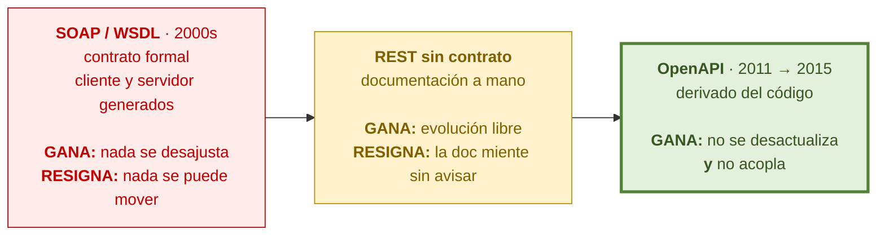

## Figura 2.2 — Los cuatro pasos de la validación

Lo que la figura tiene que dejar claro: **el handler nunca corre con entrada
inválida.** El `422` sale antes.

```mermaid
flowchart TB
    R["Petición HTTP<br/><i>todo llega como texto</i>"]
    P1["<b>1 · Parseo</b><br/>el cuerpo se interpreta<br/>según Content-Type"]
    P2["<b>2 · Coerción</b><br/>conversión al tipo declarado<br/><i>\"5\" → 5</i>"]
    P3["<b>3 · Validación</b><br/>se comprueban las restricciones<br/><i>reporta TODOS los errores</i>"]
    P4["<b>4 · Construcción</b><br/>se arma la instancia"]
    H["<b>Handler</b><br/><i>los datos ya son confiables</i>"]
    E["<b>422</b><br/>loc · type · msg · input<br/><i>y es una LISTA</i>"]
    R --> P1 --> P2 --> P3 --> P4 --> H
    P1 -.->|"JSON mal formado"| E
    P2 -.->|"no convertible"| E
    P3 -.->|"restricción violada"| E

    classDef paso fill:#DEEBF7,stroke:#2E74B5,color:#1F4E79
    classDef ok fill:#E2F0DC,stroke:#538135,color:#375623
    classDef err fill:#FDECEA,stroke:#C00000,color:#C00000
    class R,P1,P2,P3,P4 paso
    class H ok
    class E err
```

## Figura 2.3 — Los tres modelos segregados

Una fila por campo, una columna por modelo. Los campos que **sólo** aparecen en
`Public` y el que no aparece en ninguno son el punto de la figura.

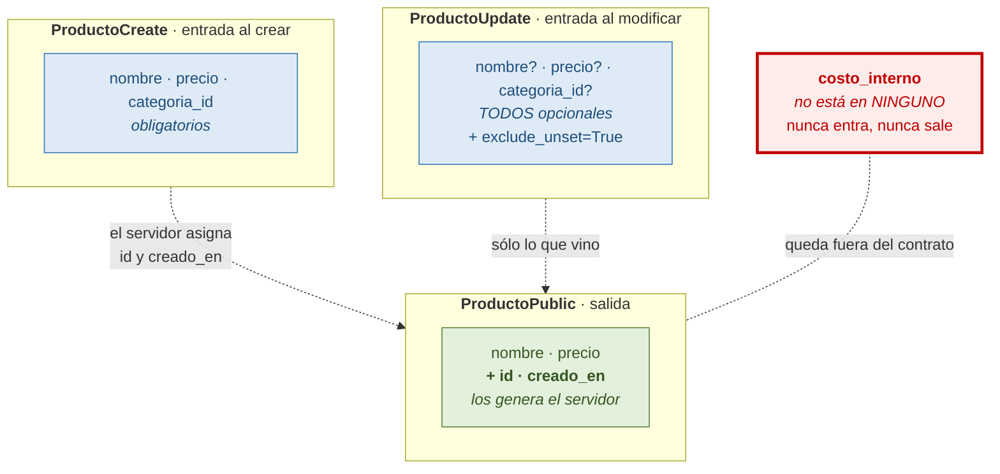

## Figura 2.4 — El importe de la base al cliente

La anotación de abajo es la figura: **en ningún punto del recorrido el valor pasa
por punto flotante.**

```mermaid
flowchart LR
    A["<b>PostgreSQL</b><br/>DECIMAL(10,2)<br/><i>exacto</i>"]
    B["<b>Modelo</b><br/>Decimal('1234.50')<br/><i>exacto</i>"]
    C["<b>JSON</b><br/>\"1234.50\"<br/><i>cadena, no número</i>"]
    D["<b>TypeScript</b><br/>total: string<br/><i>no se puede multiplicar</i>"]
    A --> B --> C --> D
    F["<b>float</b><br/>1234.4999999999998<br/><i>acá se pierde la exactitud</i>"]
    C -.->|"si viajara como<br/><b>número</b> JSON"| F

    classDef exacto fill:#E2F0DC,stroke:#538135,color:#375623
    classDef texto fill:#DEEBF7,stroke:#2E74B5,stroke-width:3px,color:#1F4E79
    classDef roto fill:#FDECEA,stroke:#C00000,stroke-dasharray:5 5,color:#C00000
    class A,B exacto
    class C,D texto
    class F roto
```

## Figura 3.1 — Concurrencia frente a paralelismo

Lo importante: **la fila de arriba también completa las tres tareas.** No hay
superposición real, y aun así avanza en todas.

```mermaid
gantt
    title Un hilo alternando (CONCURRENTE, no paralelo)
    dateFormat X
    axisFormat %s
    section Hilo único
    Tarea A · calcula      :a1, 0, 1
    Tarea A · espera E/S   :crit, a2, 1, 3
    Tarea B · calcula      :b1, 1, 2
    Tarea B · espera E/S   :crit, b2, 2, 4
    Tarea C · calcula      :c1, 2, 3
    Tarea A · reanuda      :a3, 3, 4
```

```mermaid
gantt
    title Tres núcleos (PARALELO)
    dateFormat X
    axisFormat %s
    section Núcleo 1
    Tarea A :0, 3
    section Núcleo 2
    Tarea B :0, 3
    section Núcleo 3
    Tarea C :0, 3
```

## Figura 3.2 — Cómo una petición cede el control y vuelve

Los `await` van destacados: **son los únicos puntos donde el control puede irse.**
Entre dos `await` nadie más existe.

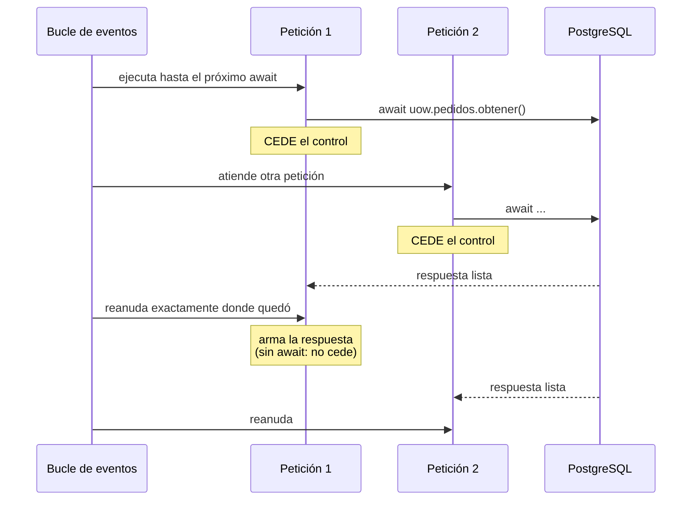

## Figura 3.3 — Qué pasa cuando una línea bloquea

La tercera columna es el punto de la figura: **tiene la apariencia de la segunda y
el comportamiento peor que la primera.**

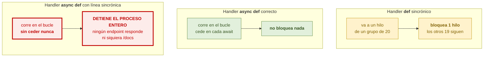

## Figura 3.4 — Dónde el ORM puede saltar al bucle y dónde no

El greenlet contiene al ORM sincrónico. **Sólo se puede saltar desde adentro**, y
sólo se entra por un `await` sobre un método del ORM.

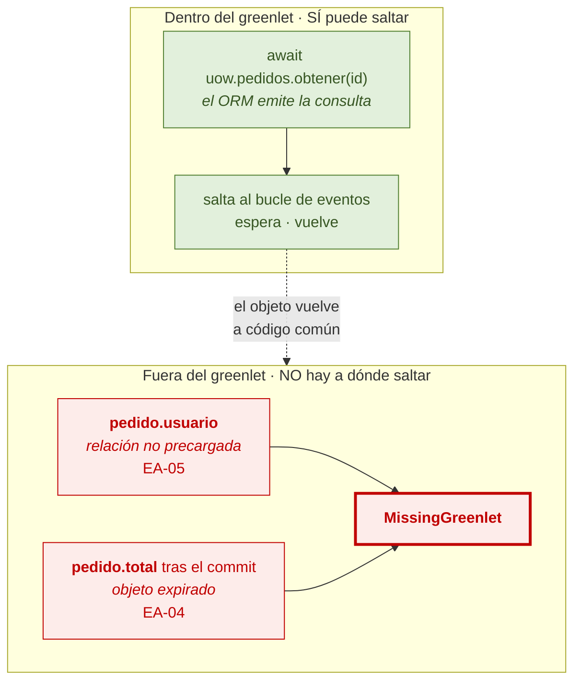

## Figura 3.5 — El techo que desaparece

A la izquierda, un límite que nadie puso y protege igual. A la derecha, el límite
que hay que poner a mano.

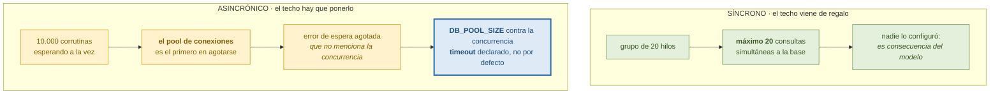

## Figura 4.1 — Las tres relaciones traducidas al esquema

En los tres casos la clave foránea va del lado "muchos". **Lo que las diferencia es
la última columna**, no dónde está la referencia.

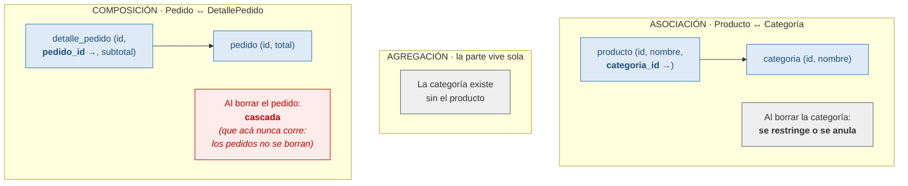

## Figura 4.3 — Carga perezosa y anticipada

Los números de abajo son la figura: **consultas emitidas** y **filas transferidas**
para el mismo listado de veinte pedidos con cinco líneas cada uno.

```mermaid
flowchart TB
    subgraph N["Sin precarga"]
        N1["1 consulta de pedidos"]
        N2["+ 1 consulta por cada acceso<br/>a pedido.detalles"]
        N3["<b>EXCEPCIÓN</b><br/>MissingGreenlet<br/><i>en la primera iteración</i>"]
        N1 --> N2 --> N3
    end
    subgraph S["selectinload · colecciones"]
        S1["1 consulta de pedidos<br/>+ 1 con IN para las líneas"]
        S2["<b>2 consultas</b><br/><b>120 filas</b> (20 + 100)"]
        S1 --> S2
    end
    subgraph J["joinedload · a uno"]
        J1["1 consulta con JOIN"]
        J2["<b>1 consulta</b><br/><b>100 filas</b><br/><i>el pedido repetido 5 veces</i>"]
        J1 --> J2
    end

    classDef mal fill:#FDECEA,stroke:#C00000,stroke-width:3px,color:#C00000
    classDef bien fill:#E2F0DC,stroke:#538135,color:#375623
    classDef ojo fill:#FFF2CC,stroke:#BF8F00,color:#7F6000
    class N1,N2,N3 mal
    class S1,S2 bien
    class J1,J2 ojo
```

## Figura 4.4 — Las cinco redundancias y su garante

La columna de la derecha es el contenido de la figura: **ninguna queda sostenida
sólo por la disciplina del Service.**

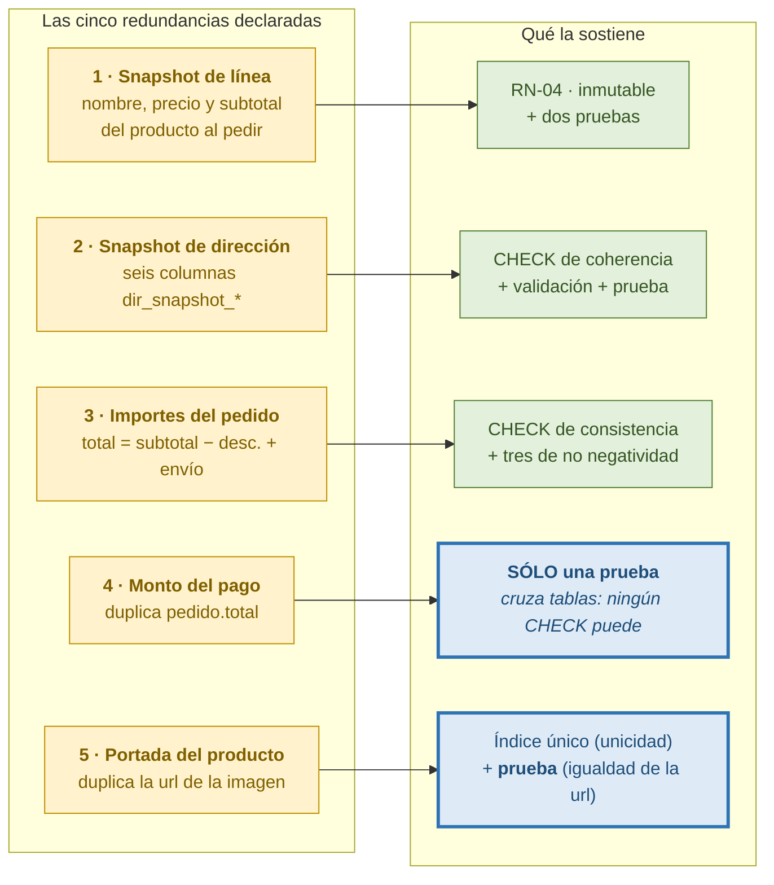

## Figura 5.1 — Los tres esquemas y qué resigna cada uno

El eje es el intercambio, no la cronología. Las dos últimas columnas son el
contenido de la figura.

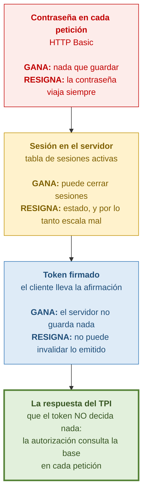

## Figura 5.2 — Las tres partes de un token

La palabra clave de la figura es **codificado**, no cifrado. El contenido lo lee
cualquiera.

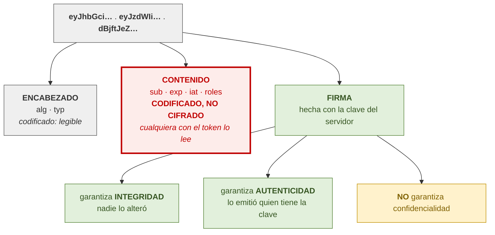

## Figura 5.3 — El flujo de login paso a paso

El paso 2 va destacado: **se decide sin calcular**. Un intento rechazado cuesta una
consulta, no trescientos milisegundos.

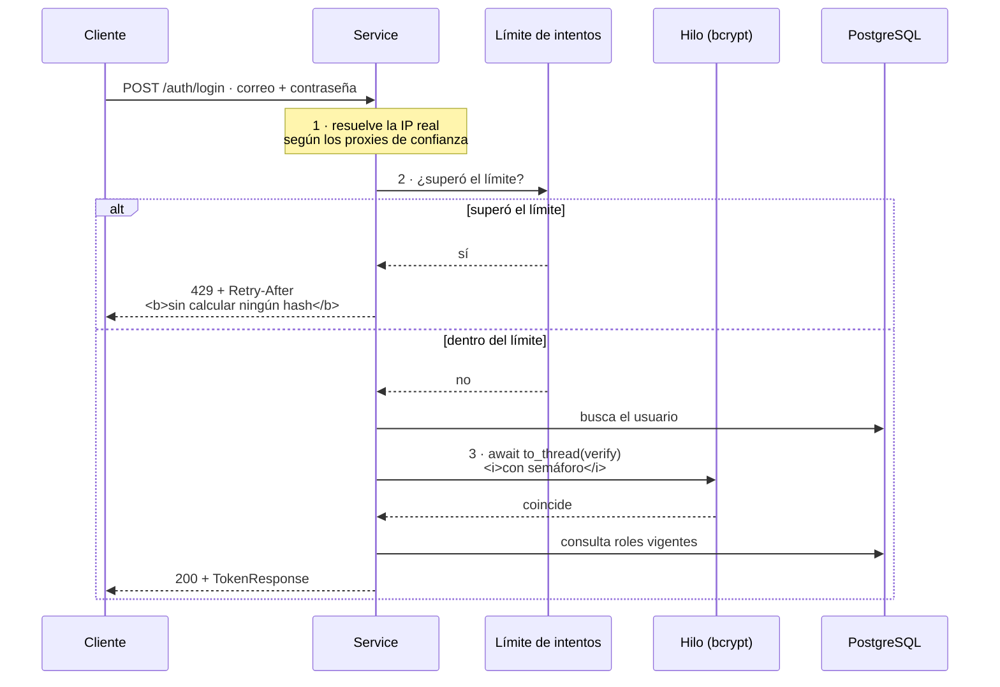

## Figura 5.4 — bcrypt: tres configuraciones

Las tres columnas con su consecuencia. La primera es la que hay que evitar; la
tercera es la que el TPI exige.

```mermaid
flowchart TB
    subgraph A["1 · Dentro del bucle"]
        A1["pwd_context.verify(...)<br/><i>llamada directa</i>"]
        A2["<b>300 ms sin atender NADA</b><br/>ni catálogo, ni SSE,<br/>ni el healthcheck"]
        A3["3 logins/s saturan el proceso"]
        A1 --> A2 --> A3
    end
    subgraph B["2 · En un hilo, sin cota"]
        B1["await to_thread.run_sync(...)"]
        B2["el bucle sigue atendiendo"]
        B3["<b>100 logins = 100 hilos</b><br/>compitiendo por los núcleos"]
        B1 --> B2 --> B3
    end
    subgraph C["3 · En un hilo, con semáforo"]
        C1["async with semaforo:<br/>await to_thread.run_sync(...)"]
        C2["<b>4 permisos = 4 núcleos</b> como máximo"]
        C3["las que esperan son corrutinas:<br/><i>cuestan memoria y nada más</i>"]
        C1 --> C2 --> C3
    end

    classDef mal fill:#FDECEA,stroke:#C00000,stroke-width:3px,color:#C00000
    classDef medio fill:#FFF2CC,stroke:#BF8F00,color:#7F6000
    classDef bien fill:#E2F0DC,stroke:#538135,stroke-width:3px,color:#375623
    class A1,A2,A3 mal
    class B1,B2,B3 medio
    class C1,C2,C3 bien
```

## Figura 5.5 — Los dos routers

La anotación de la derecha es el contenido: **las dependencias se suman hacia
abajo y no hay forma de restar una en un endpoint concreto.**

```mermaid
flowchart TB
    APP["Aplicación"]
    RA["<b>Router ABIERTO</b><br/>sin la dependencia"]
    RP["<b>Router PROTEGIDO</b><br/>dependencies=[Depends(require_password_ok)]"]
    APP --> RA
    APP --> RP
    RA --> E1["POST /auth/login"]
    RA --> E2["POST /auth/register"]
    RA --> E3["GET /auth/me"]
    RA --> E4["POST /auth/cambiar-password"]
    RA --> E5["catálogo público"]
    RP --> P1["todo lo demás<br/><b>403 PASSWORD_CAMBIO_REQUERIDO</b><br/>mientras el flag esté activo"]
    RP --> P2["GET /eventos<br/><i>se rechaza en el handshake</i>"]
    N["<b>Por qué no se resuelve<br/>con exclusiones:</b><br/>FastAPI ACUMULA las dependencias<br/>de aplicación, router y ruta,<br/>y no ofrece forma de quitar una"]

    classDef abierto fill:#E2F0DC,stroke:#538135,color:#375623
    classDef prot fill:#FDECEA,stroke:#C00000,color:#C00000
    classDef nota fill:#DEEBF7,stroke:#2E74B5,stroke-width:3px,color:#1F4E79
    class RA,E1,E2,E3,E4,E5 abierto
    class RP,P1,P2 prot
    class N nota
```


## Figura 6.1 — Las cuatro propiedades de una transacción

El aislamiento va destacado: es el único que **tiene grados**, y el que la clase 7
necesita entero.

```mermaid
flowchart TB
    T["<b>Una transacción garantiza</b>"]
    T --> A["<b>ATOMICIDAD</b><br/>todo o nada<br/><i>crear el usuario Y su rol,<br/>o ninguna de las dos</i>"]
    T --> C["<b>CONSISTENCIA</b><br/>las restricciones se cumplen<br/><i>un pedido confirmado no puede<br/>dejar stock negativo</i>"]
    T --> I["<b>AISLAMIENTO</b><br/><b>TIENE GRADOS</b><br/><i>dos pedidos del último producto<br/>no lo venden dos veces</i><br/>→ el nivel por defecto NO alcanza"]
    T --> D["<b>DURABILIDAD</b><br/>lo confirmado sobrevive<br/><i>por eso PostgreSQL es el único<br/>almacén durable</i>"]

    classDef base fill:#EFEFEF,stroke:#595959,color:#333333
    classDef ok fill:#E2F0DC,stroke:#538135,color:#375623
    classDef ojo fill:#FDECEA,stroke:#C00000,stroke-width:3px,color:#C00000
    class T base
    class A,C,D ok
    class I ojo
```

## Figura 6.2 — La operación a medias

Lo que la figura tiene que gritar: **las dos respuestas HTTP son idénticas.** La
diferencia está en lo que quedó adentro.

```mermaid
flowchart TB
    subgraph SIN["Sin Unit of Work"]
        S1["crear usuario → <b>COMMIT</b>"]
        S2["asignar rol → <b>FALLA</b>"]
        S3["<b>QUEDA:</b> un usuario sin rol<br/><i>existe, inicia sesión,<br/>no puede comprar</i>"]
        S4["respuesta: <b>500</b>"]
        S1 --> S2 --> S3
        S2 --> S4
    end
    subgraph CON["Con Unit of Work"]
        C1["async with uow:"]
        C2["crear usuario → flush"]
        C3["asignar rol → <b>FALLA</b>"]
        C4["<b>ROLLBACK automático</b><br/>al salir con excepción"]
        C5["<b>QUEDA:</b> nada"]
        C6["respuesta: <b>500</b>"]
        C1 --> C2 --> C3 --> C4 --> C5
        C3 --> C6
    end
    N["<b>Las dos respuestas son iguales.</b><br/>Desde afuera no se distingue.<br/>La diferencia es el dato corrupto<br/>que nadie sabe que existe."]

    classDef mal fill:#FDECEA,stroke:#C00000,color:#C00000
    classDef bien fill:#E2F0DC,stroke:#538135,color:#375623
    classDef nota fill:#DEEBF7,stroke:#2E74B5,stroke-width:3px,color:#1F4E79
    class S1,S2,S3,S4 mal
    class C1,C2,C3,C4,C5,C6 bien
    class N nota
```

## Figura 6.3 — Quién crea, quién abre, quién confirma y quién cierra

Cuatro responsabilidades en cuatro lugares. El cierre ocurre **después** de que la
respuesta salió.

```mermaid
sequenceDiagram
    participant D as get_session()
    participant U as get_uow()
    participant R as Router
    participant S as Service
    participant DB as PostgreSQL
    D->>DB: obtiene una sesión del pool
    Note over D: la cede (yield)
    D->>U: la misma sesión
    U->>U: construye UnitOfWork(session)<br/><b>sin abrirlo</b>
    U->>R: lo entrega como dependencia
    R->>S: lo transporta<br/><b>no lo abre, no lo usa</b>
    S->>S: async with uow:
    S->>DB: escritura 1 (flush)
    S->>DB: escritura 2 (flush)
    Note over S: sale del bloque
    S->>DB: <b>COMMIT</b>
    S-->>R: resultado
    R-->>D: respuesta enviada
    D->>DB: <b>cierra la sesión</b> (finally)
    Note over D: quien la creó, la cierra
```

## Figura 6.4 — Por qué el intento de acceso necesita su propia transacción

La circularidad es el contenido de la figura: **lo que se quiere registrar es lo que
destruye el registro.**

```mermaid
flowchart TB
    subgraph MAL["Dentro de la transacción de la petición"]
        M1["login con contraseña incorrecta"]
        M2["se registra el intento fallido"]
        M3["la excepción revierte la transacción"]
        M4["<b>el registro del intento se borra</b>"]
        M5["<b>el límite nunca cuenta nada</b>"]
        M1 --> M2 --> M3 --> M4 --> M5
    end
    subgraph BIEN["Con sesión y transacción propias"]
        B1["login con contraseña incorrecta"]
        B2["sesión aparte: registra y <b>confirma siempre</b>"]
        B3["la excepción revierte la transacción de la petición"]
        B4["<b>el registro sobrevive</b>"]
        B5["el límite cuenta correctamente"]
        B1 --> B2
        B1 --> B3
        B2 --> B4 --> B5
    end
    C["<b>Costo declarado:</b> introduce estado externo,<br/>enumerado en la sección 15.1<br/>con su fixture de limpieza"]

    classDef mal fill:#FDECEA,stroke:#C00000,color:#C00000
    classDef bien fill:#E2F0DC,stroke:#538135,color:#375623
    classDef costo fill:#FFF2CC,stroke:#BF8F00,color:#7F6000
    class M1,M2,M3,M4,M5 mal
    class B1,B2,B3,B4,B5 bien
    class C costo
```

## Figura 6.5 — Las dos jerarquías de repositorio

La razón de que sean dos va anotada: un filtro universal fallaría sobre las tablas
que no tienen la columna.

```mermaid
flowchart TB
    B["<b>BaseRepository[T]</b><br/>get_by_id · get_for_update<br/>get_many_for_update · list · count<br/>create · update · hard_delete"]
    S["<b>SoftDeleteRepository[T]</b><br/>+ get_by_id_including_deleted<br/>+ soft_delete<br/><i>y get_by_id filtra deleted_at</i>"]
    B --> S
    B --> B1["<b>18 modelos</b><br/>Pedido · DetallePedido · Pago<br/>MovimientoStock · las 5 catálogo…"]
    S --> S1["<b>5 modelos</b><br/>Usuario · DireccionEntrega<br/>Categoria · Producto · Ingrediente"]
    N["<b>Por qué dos y no una:</b><br/>un único genérico que filtrara deleted_at<br/>produciría un error de SQL sobre<br/>las tablas que no tienen la columna"]

    classDef base fill:#DEEBF7,stroke:#2E74B5,color:#1F4E79
    classDef soft fill:#E2F0DC,stroke:#538135,color:#375623
    classDef nota fill:#EFEFEF,stroke:#595959,stroke-width:3px,color:#333333
    class B,B1 base
    class S,S1 soft
    class N nota
```

## Figura 7.1 — Los cuatro fenómenos de concurrencia

El cuarto va destacado con su anotación: **el estándar no obliga a prevenirlo en el
nivel predeterminado.**

```mermaid
flowchart TB
    T["<b>Dos transacciones sobre los mismos datos</b>"]
    T --> A["<b>LECTURA SUCIA</b><br/>leer lo que otra no confirmó<br/><i>ver un pedido confirmado<br/>que después se revierte</i>"]
    T --> B["<b>LECTURA NO REPETIBLE</b><br/>leer dos veces da distinto<br/><i>el stock cambia entre<br/>la verificación y el descuento</i>"]
    T --> C["<b>LECTURA FANTASMA</b><br/>aparecen filas nuevas<br/><i>pedidos nuevos a mitad<br/>de un informe</i>"]
    T --> D["<b>ACTUALIZACIÓN PERDIDA</b><br/>las dos leen, calculan y escriben<br/><b>una pisa a la otra</b><br/><i>dos ventas del último producto</i>"]
    D --> N["<b>El estándar SQL no la enumera</b><br/>entre los fenómenos que el nivel<br/>de lectura confirmada previene.<br/><b>Por eso no la previene.</b>"]

    classDef base fill:#EFEFEF,stroke:#595959,color:#333333
    classDef otros fill:#FFF2CC,stroke:#BF8F00,color:#7F6000
    classDef ojo fill:#FDECEA,stroke:#C00000,stroke-width:3px,color:#C00000
    class T base
    class A,B,C otros
    class D,N ojo
```

## Figura 7.2 — La actualización perdida, momento por momento

Lo que la figura tiene que gritar: **ninguna de las dos transacciones falló.**

```mermaid
sequenceDiagram
    participant A as Transacción A
    participant DB as PostgreSQL<br/>(stock = 1)
    participant B as Transacción B
    A->>DB: 1 · lee stock
    DB-->>A: 1
    B->>DB: 2 · lee stock
    DB-->>B: 1
    Note over A: 3 · verifica: 1 >= 1 ✓
    Note over B: 4 · verifica: 1 >= 1 ✓
    A->>DB: 5 · escribe stock = 0
    B->>DB: 6 · escribe stock = 0
    Note over A,B: <b>Se vendieron DOS unidades.</b><br/><b>El stock bajó UNA.</b><br/>Las dos confirmaron. Ninguna falló.<br/>Ningún registro dice que algo salió mal.
```

## Figura 7.3 — El interbloqueo entre familias

**La figura más importante del capítulo.** Las dos transacciones ordenaron
perfectamente dentro de cada familia. Se trabaron igual.

```mermaid
flowchart TB
    subgraph MAL["Sin orden ENTRE familias · las dos ordenadas por dentro"]
        direction TB
        M1["<b>Transacción A</b><br/>1 · bloquea <b>producto 5</b><br/>2 · pide <b>ingrediente 2</b>"]
        M2["<b>Transacción B</b><br/>1 · bloquea <b>ingrediente 2</b><br/>2 · pide <b>producto 5</b>"]
        M3["<b>INTERBLOQUEO</b><br/>el motor mata una de las dos"]
        M1 --> M3
        M2 --> M3
        M4["<b>Cada una ordenó bien sus IDs.</b><br/>Empezaron por familias distintas.<br/><b>Con eso alcanzó.</b>"]
        M3 --> M4
    end
    subgraph BIEN["RN-18 completa · productos primero, insumos después, SIEMPRE"]
        direction TB
        B1["<b>Transacción A</b><br/>1 · <b>producto 5</b><br/>2 · <b>ingrediente 2</b>"]
        B2["<b>Transacción B</b><br/>1 · <b>producto 5</b> → espera<br/>2 · <b>ingrediente 2</b>"]
        B3["<b>B espera a A y avanza.</b><br/>Sin coordinación entre ellas:<br/>alcanza con que las dos<br/>sigan la misma convención."]
        B1 --> B3
        B2 --> B3
    end

    classDef mal fill:#FDECEA,stroke:#C00000,color:#C00000
    classDef alerta fill:#FDECEA,stroke:#C00000,stroke-width:3px,color:#C00000
    classDef bien fill:#E2F0DC,stroke:#538135,color:#375623
    classDef nota fill:#DEEBF7,stroke:#2E74B5,stroke-width:3px,color:#1F4E79
    class M1,M2 mal
    class M3,M4 alerta
    class B1,B2 bien
    class B3 nota
```

## Figura 7.4 — Los siete mecanismos y qué protege cada uno

Debe verse que **ninguno reemplaza a otro**: cada uno cubre un problema distinto.

```mermaid
flowchart LR
    C["<b>Control de<br/>concurrencia</b>"]
    C --> M1["<b>1 · Bloqueo de la transición</b><br/>RN-10<br/><i>evita: dos confirmaciones<br/>del mismo pedido</i>"]
    C --> M2["<b>2 · Bloqueo pesimista del stock</b><br/>SELECT … FOR UPDATE<br/><i>evita: dos descuentos<br/>sobre la misma lectura</i>"]
    C --> M3["<b>3 · Orden de bloqueo</b><br/>RN-08 · RN-18<br/><i>evita: que se traben<br/>mutuamente</i>"]
    C --> M4["<b>4 · Verificación POSTERIOR</b><br/><i>evita: decidir con datos<br/>leídos antes del bloqueo</i><br/><b>el que más se olvida</b>"]
    C --> M5["<b>5 · Tiempos límite</b><br/><i>evita: la espera infinita</i><br/>vencer → 409 reintentable"]
    C --> M6["<b>6 · Restricción de respaldo</b><br/>CHECK de no negatividad<br/><i>última línea, NO validación</i>"]
    C --> M7["<b>7 · Lo que Redis NO hace</b><br/><i>un lock distribuido no vive<br/>dentro de la transacción<br/>que protege</i>"]

    classDef base fill:#EFEFEF,stroke:#595959,color:#333333
    classDef ok fill:#E2F0DC,stroke:#538135,color:#375623
    classDef ojo fill:#FDECEA,stroke:#C00000,stroke-width:3px,color:#C00000
    classDef nota fill:#FFF2CC,stroke:#BF8F00,color:#7F6000
    class C base
    class M1,M2,M3,M5 ok
    class M4 ojo
    class M6,M7 nota
```

## Figura 7.5 — El punto único de escritura del stock

La flecha tachada es parte del contenido: el TPI la declara **un defecto de
implementación, no una alternativa.**

```mermaid
flowchart TB
    S1["Confirmar pedido<br/><i>descuenta</i>"]
    S2["Cancelar pedido<br/><i>repone</i>"]
    S3["Ajuste manual<br/><i>corrige</i>"]
    S4["Recepción de insumos<br/><i>ingresa</i>"]
    F["<b>stock.aplicar_movimiento()</b><br/>ÚNICO camino admitido<br/><br/>· actualiza la columna<br/>· inserta MovimientoStock<br/>· convierte la unidad<br/><b>todo en la misma transacción</b>"]
    S1 --> F
    S2 --> F
    S3 --> F
    S4 --> F
    F --> C["<b>columna de stock</b><br/><i>la conveniencia</i>"]
    F --> M["<b>MovimientoStock</b><br/><i>la verdad</i>"]
    X["<b>UPDATE directo</b><br/>❌ defecto de implementación,<br/>no una alternativa"]
    X -.->|"RN-11 lo prohíbe"| C
    V["<b>Verificación:</b> sumar los movimientos<br/>de un producto debe dar su columna.<br/><b>Si no da, alguien escribió por otro lado.</b>"]
    M --> V
    C --> V

    classDef svc fill:#DEEBF7,stroke:#2E74B5,color:#1F4E79
    classDef punto fill:#E2F0DC,stroke:#538135,stroke-width:3px,color:#375623
    classDef dato fill:#EFEFEF,stroke:#595959,color:#333333
    classDef mal fill:#FDECEA,stroke:#C00000,stroke-width:3px,color:#C00000
    classDef ver fill:#FFF2CC,stroke:#BF8F00,stroke-width:3px,color:#7F6000
    class S1,S2,S3,S4 svc
    class F punto
    class C,M dato
    class X mal
    class V ver
```

## Figura 8.1 — La escritura dual: los dos órdenes, los dos malos

Lo que la figura tiene que dejar claro: **no hay un tercer orden**, y de los dos
errores **uno se puede arreglar después y el otro no.**

```mermaid
flowchart TB
    subgraph A["Orden 1 · publicar y después confirmar"]
        A1["PUBLISH: pedido 42 confirmado"]
        A2["💀 el proceso muere"]
        A3["<b>QUEDA:</b> la cocina vio un pedido<br/><b>que nunca existió</b>"]
        A4["<b>El sistema mostró una mentira.</b><br/>Alguien ya lo vio.<br/><b>NO se puede arreglar.</b>"]
        A1 --> A2 --> A3 --> A4
    end
    subgraph B["Orden 2 · confirmar y después publicar"]
        B1["COMMIT: el pedido 42 existe"]
        B2["💀 el proceso muere"]
        B3["<b>QUEDA:</b> el pedido existe<br/><b>y nadie se enteró</b>"]
        B4["<b>El sistema está atrasado.</b><br/>Si guardaste que faltaba avisar,<br/><b>se avisa más tarde.</b>"]
        B1 --> B2 --> B3 --> B4
    end
    C["<b>El buzón de salida elige el orden 2</b><br/>y arma el mecanismo que lo recupera"]
    B4 --> C

    classDef mal fill:#FDECEA,stroke:#C00000,stroke-width:3px,color:#C00000
    classDef medio fill:#FFF2CC,stroke:#BF8F00,color:#7F6000
    classDef sol fill:#E2F0DC,stroke:#538135,stroke-width:3px,color:#375623
    class A1,A2,A3,A4 mal
    class B1,B2,B3 medio
    class B4,C sol
```

## Figura 8.2 — El camino de un evento, los seis pasos

**El paso 2 va destacado**: en ese instante el hecho y su anuncio son igual de
ciertos. La ventana del paso 3 al 4 es la entrega al menos una vez.

```mermaid
sequenceDiagram
    participant S as Service
    participant DB as PostgreSQL
    participant W as Worker (publicar_outbox)
    participant R as Redis Pub/Sub
    participant API as Handler SSE
    participant C as Cliente
    Note over S,DB: dentro de la transacción de negocio
    S->>DB: 1 · UPDATE pedido + INSERT historial<br/><b>+ INSERT EventoSalida</b> (no publica · RN-14)
    S->>DB: 2 · <b>COMMIT</b>
    Note over DB: <b>el hecho y su anuncio son igual de ciertos:</b><br/>o están los dos o no está ninguno
    W->>DB: 3 · toma el lote<br/>FOR UPDATE SKIP LOCKED, ORDER BY id
    W->>R: PUBLISH en el canal de cada evento
    Note over W,R: si muere acá, se publica de nuevo<br/><b>entrega al menos una vez (RN-15)</b>
    W->>DB: 4 · marca publicados<br/><i>en la MISMA transacción que los tomó</i>
    R->>API: 5 · el canal entrega
    API->>API: verifica que ESTE cliente pueda verlo
    API->>C: emite con id = id de EventoSalida
    C->>C: 6 · invalida la clave (RN-F09)
    C->>API: GET /pedidos/42 · <b>el dato autoritativo</b>
```

## Figura 8.3 — El evento con dato contra el evento vacío

Los mismos dos eventos llegando repetidos y desordenados. **La comparación es el
contenido de la figura.**

```mermaid
flowchart TB
    subgraph CON["Evento CON el dato"]
        X1["evento: {pedido 42, estado: EN_PREP}"]
        X2["evento: {pedido 42, estado: LISTO}"]
        X3["<b>llegan invertidos</b>"]
        X4["<b>la pantalla muestra EN_PREP</b><br/>cuando el pedido ya está LISTO"]
        X1 --> X3
        X2 --> X3 --> X4
    end
    subgraph SIN["Evento VACÍO"]
        Y1["evento: el pedido 42 cambió"]
        Y2["evento: el pedido 42 cambió"]
        Y3["<b>llegan invertidos · da igual</b>"]
        Y4["invalidar dos veces = invalidar una<br/><b>idempotente y conmutativo<br/>por construcción</b>"]
        Y5["<b>GET /pedidos/42</b><br/>trae el estado real, con<br/>la autorización de la API"]
        Y1 --> Y3
        Y2 --> Y3 --> Y4 --> Y5
    end

    classDef mal fill:#FDECEA,stroke:#C00000,color:#C00000
    classDef alerta fill:#FDECEA,stroke:#C00000,stroke-width:3px,color:#C00000
    classDef bien fill:#E2F0DC,stroke:#538135,color:#375623
    classDef nota fill:#DEEBF7,stroke:#2E74B5,stroke-width:3px,color:#1F4E79
    class X1,X2,X3 mal
    class X4 alerta
    class Y1,Y2,Y3 bien
    class Y4,Y5 nota
```

## Figura 8.4 — Las siete reglas del trabajo diferido

**TB-01 va en el centro**: es la que hace posibles a las otras seis.

```mermaid
flowchart TB
    T["<b>TB-01 · Ninguna tarea está<br/>en el camino crítico</b><br/><i>si la operación no se completa<br/>sin la tarea, está MAL PARTIDA</i><br/><b>por eso el encolado puede fallar</b>"]
    T --> A["<b>TB-02</b> · toda tarea es idempotente<br/><i>entrega al menos una vez:<br/>morir después de trabajar y antes<br/>de confirmar la repite</i>"]
    T --> B["<b>TB-03</b> · nunca objetos, solo IDs<br/><i>un objeto serializado<br/>es una foto vieja</i>"]
    T --> C["<b>TB-04</b> · sesión y UoW propios,<br/>y llama al MISMO Service<br/><i>no hay lógica que viva<br/>solo en una tarea</i>"]
    T --> D["<b>TB-05</b> · declara reintentos<br/>y qué hace al agotarlos<br/><i>fallar en silencio es peor<br/>que no existir</i>"]
    T --> E["<b>TB-06</b> · el X-Request-Id viaja<br/><i>sin eso, el error del worker<br/>no se ata a su origen</i>"]
    T --> F["<b>TB-07</b> · no publica en Redis<br/><i>escribe en el outbox<br/>como cualquier Service</i>"]

    classDef madre fill:#E2F0DC,stroke:#538135,stroke-width:3px,color:#375623
    classDef hija fill:#DEEBF7,stroke:#2E74B5,color:#1F4E79
    class T madre
    class A,B,C,D,E,F hija
```

## Figura 8.5 — Los cinco usos de Redis y su política de degradación

Las cinco son **distintas**. Las dos que degradan pueden hacerlo **porque la copia
durable ya existía**.

```mermaid
flowchart LR
    R["<b>Redis caído</b><br/><i>o sin responder<br/>dentro del timeout</i>"]
    R --> R1["<b>R-1 · límite de intentos</b><br/><b>DEGRADAR</b> a IntentoAcceso<br/><i>misma ventana, mismos umbrales</i><br/>abierto = sin protección justo<br/>cuando el atacante prueba<br/><b>IntentoAcceso es el plan B</b>"]
    R --> R2["<b>R-2 · caché</b><br/><b>FALLAR ABIERTO</b> → NullCache<br/><i>todo va a PostgreSQL;<br/>misma respuesta, más latencia</i><br/><b>una caché cuya caída da errores<br/>es una dependencia dura disfrazada</b>"]
    R --> R3["<b>R-3 · eventos</b><br/><b>ACUMULAR</b><br/><i>sin marcar y SIN contar intentos;<br/>espacia los ciclos</i><br/><b>nada se pierde, solo se atrasa</b>"]
    R --> R4["<b>R-4 · cola de tareas</b><br/><b>FALLAR ABIERTO</b> al encolar<br/><i>lo registra y sigue</i><br/><b>ninguna operación falla<br/>por no poder encolar (TB-01)</b>"]
    R --> R5["<b>R-5 · idempotencia</b><br/><b>DEGRADAR</b> al nivel 2<br/><i>la unicidad hace todo el trabajo</i><br/><b>un mecanismo de corrección que<br/>depende de una caché NO lo es</b>"]

    classDef base fill:#FDECEA,stroke:#C00000,stroke-width:3px,color:#C00000
    classDef degradar fill:#E2F0DC,stroke:#538135,stroke-width:3px,color:#375623
    classDef abierto fill:#FFF2CC,stroke:#BF8F00,color:#7F6000
    class R base
    class R1,R5 degradar
    class R2,R3,R4 abierto
```

## Figura 8.6 — La reconexión: por qué suscribirse primero

No se eligió el orden que no falla: **no existe**. Se eligió el orden cuyo error el
sistema ya sabe absorber.

```mermaid
flowchart TB
    E["<b>El cliente reconecta</b><br/>Last-Event-ID: 8412<br/><i>Redis Pub/Sub NO persiste:<br/>lo publicado mientras no estaba, se perdió</i>"]
    E --> A["<b>Orden A · suscribirse primero</b><br/>1 · suscribe al canal<br/>2 · SELECT … WHERE id > 8412<br/>3 · emite los recuperados"]
    E --> B["<b>Orden B · consultar primero</b><br/>1 · SELECT … WHERE id > 8412<br/>2 · emite los recuperados<br/>3 · suscribe al canal"]
    A --> A2["<b>RIESGO: duplicar</b><br/>un evento publicado entre 1 y 2<br/>llega por los dos caminos"]
    B --> B2["<b>RIESGO: perder</b><br/>un evento publicado entre 2 y 3<br/>no llega por ninguno"]
    A2 --> A3["<b>TOLERABLE</b><br/>RN-15 ya declara<br/>entrega al menos una vez,<br/>y el evento es idempotente<br/>porque no lleva el dato"]
    B2 --> B3["<b>NO TOLERABLE</b><br/>la vista queda desactualizada<br/>y nadie se entera"]
    A3 --> S["<b>Se elige el orden A</b>"]

    classDef base fill:#EFEFEF,stroke:#595959,color:#333333
    classDef ok fill:#E2F0DC,stroke:#538135,color:#375623
    classDef mal fill:#FDECEA,stroke:#C00000,stroke-width:3px,color:#C00000
    classDef sol fill:#DEEBF7,stroke:#2E74B5,stroke-width:3px,color:#1F4E79
    class E,A,B base
    class A2,A3 ok
    class B2,B3 mal
    class S sol
```
