# Diagramas — Frontend desde cero

Código Mermaid de las figuras declaradas como `diagrama` en
[`FIGURAS.md`](FIGURAS.md). Un bloque por figura, encabezado por su número.

Se rinden a imagen antes de insertarlos en el `.docx`: el manuscrito Word no
lleva Mermaid.

---

## Figura 1.1 — El recorrido de una petición

Los pasos 1 a 4 son red; los 5 a 8 son navegador. La separación tiene que verse:
es la que explica por qué un fallo de resolución no deja rastro en el servidor.

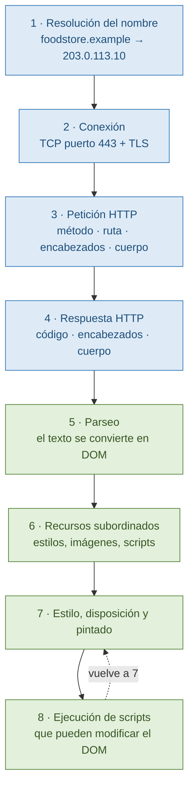

## Figura 1.2 — Anatomía de una petición HTTP

La línea en blanco va destacada: es el delimitador que separa metadatos de datos
y el que nadie ve hasta que se lo señalan.

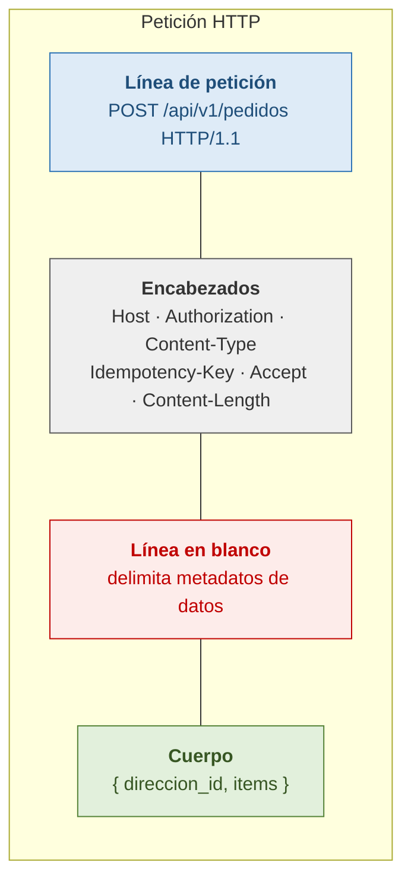

## Figura 1.3 — Anatomía de una URL

El fragmento se marca aparte: es el único componente que **no viaja al
servidor**, y esa propiedad tiene consecuencias prácticas.

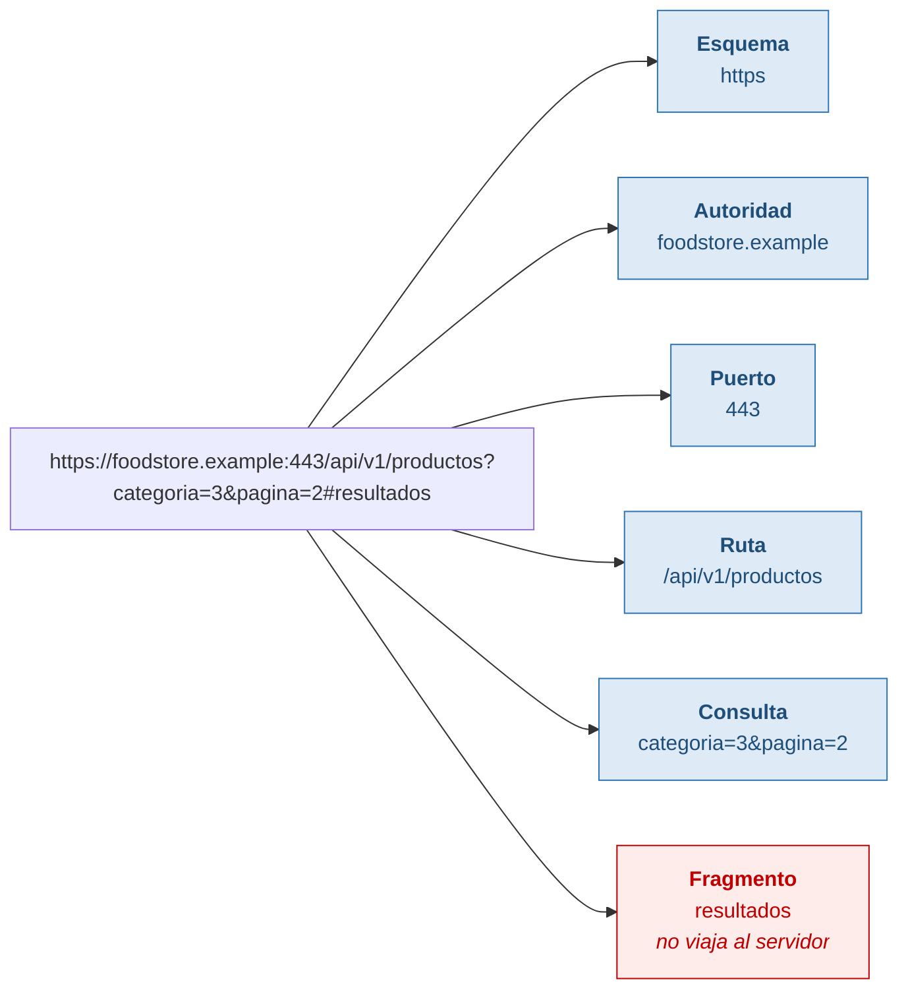

## Figura 1.4 — Del byte al píxel

El árbol de render tiene que verse **más chico** que el DOM: es la forma visual
de explicar que un nodo con `display: none` existe y no se dibuja.

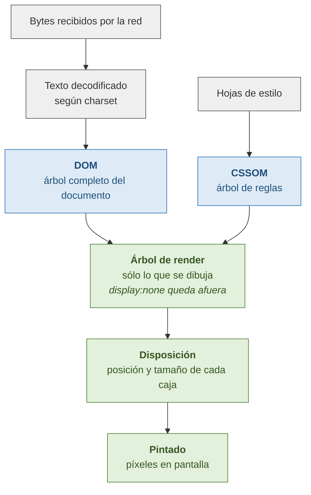

## Figura 2.1 — Las cuatro áreas del modelo de caja

El margen va con relleno transparente y borde punteado: es la única de las cuatro
áreas donde el fondo del elemento **no** se ve. Esa es la diferencia práctica
entre relleno y margen.

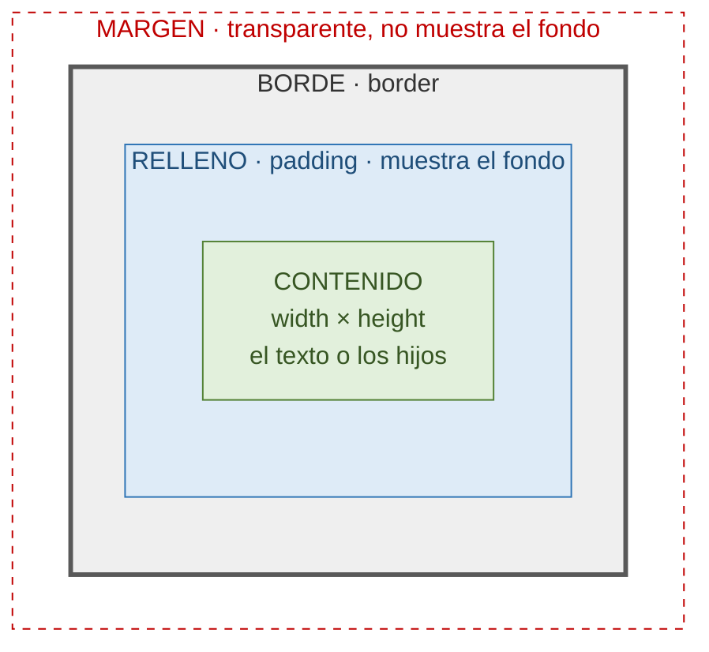

## Figura 2.2 — `content-box` frente a `border-box`

Misma declaración, dos anchos reales. El número final de cada columna es el punto
de la figura.

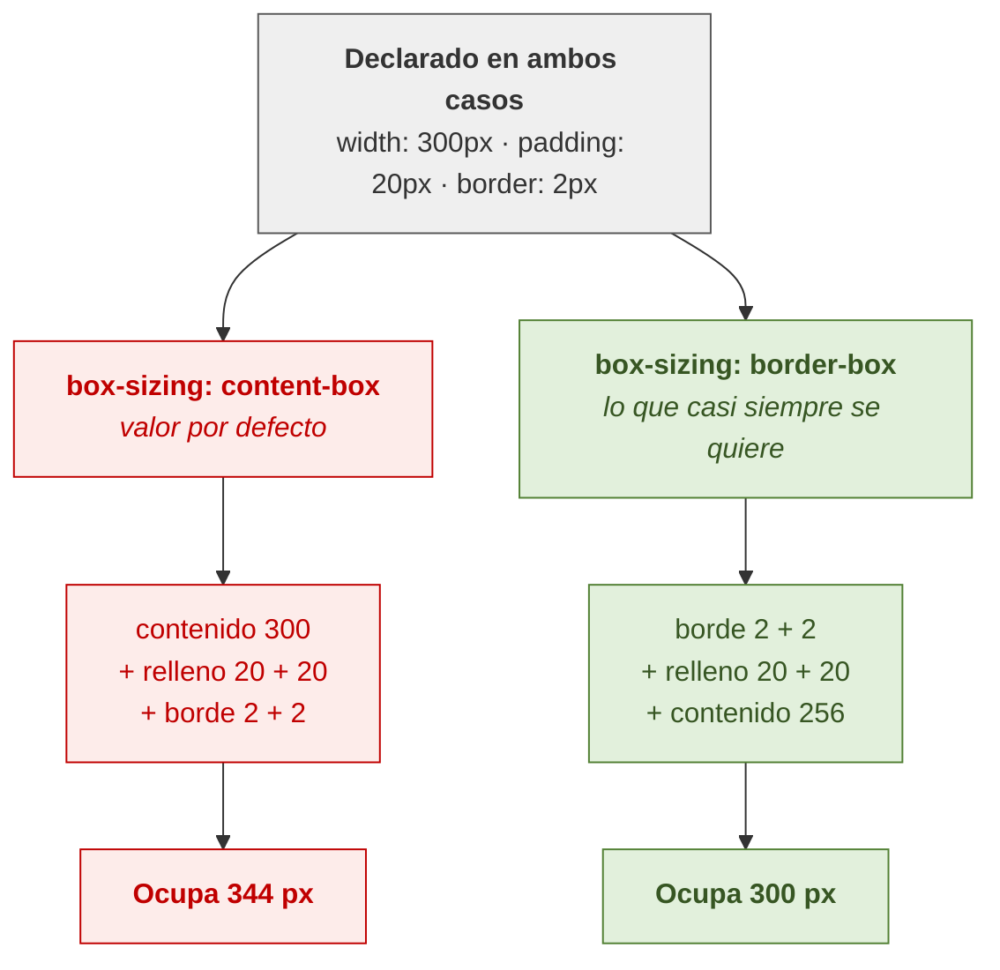

## Figura 2.3 — El orden de la cascada

Lo importante de esta figura es que se vea que **en cuanto un criterio decide, los
siguientes no se consultan**. La especificidad es el tercero, no el primero.

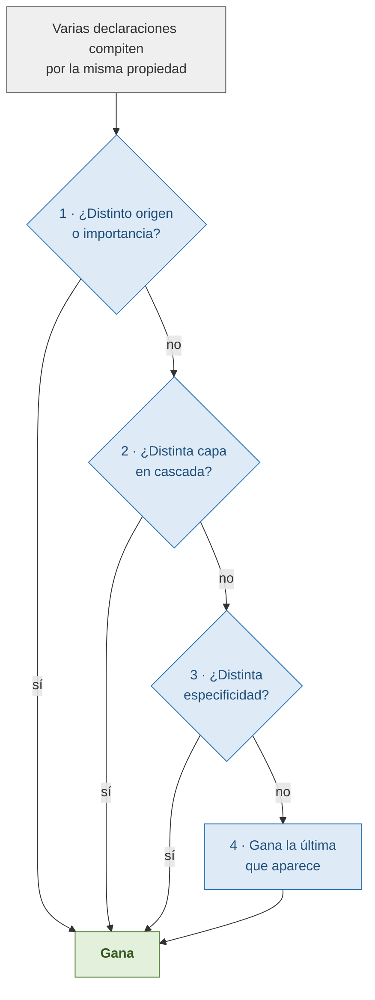

## Figura 2.4 — Los ejes de Flexbox

Dos contenedores idénticos con distinto `flex-direction`. Las etiquetas de los
ejes son el contenido de la figura: muestran por qué `justify-content` cambia de
efecto visual sin cambiar de definición.

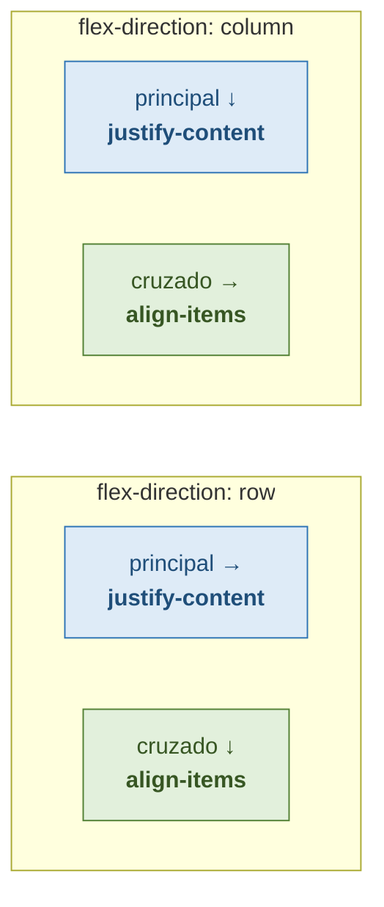

## Figura 2.5 — Grid adaptable con `auto-fill` y `minmax`

Tres anchos de contenedor, una sola declaración de CSS y ninguna consulta de
medios. La declaración va al pie, visible en los tres casos.

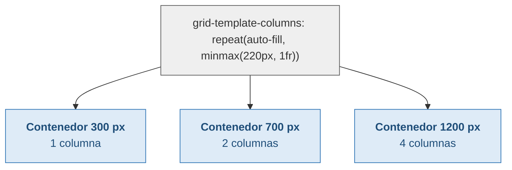

## Figura 3.1 — De Mocha al ciclo anual

El nodo de ES4 abandonado va en rojo y con su consecuencia anotada: de esa crisis
sale la decisión de avanzar en incrementos chicos y publicar una vez por año.

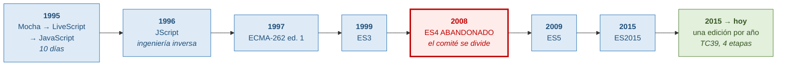

## Figura 3.2 — Valor y referencia en memoria

Lo que la figura tiene que hacer evidente: en la columna izquierda hay dos cajas;
en la derecha hay dos flechas a **una sola** caja.

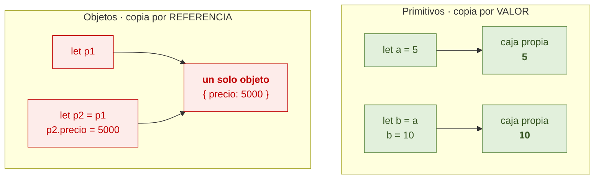

## Figura 3.3 — Pila, colas y bucle de eventos

Las dos colas van separadas y con su regla de vaciado escrita al lado: es la
diferencia que explica todo el orden de ejecución.

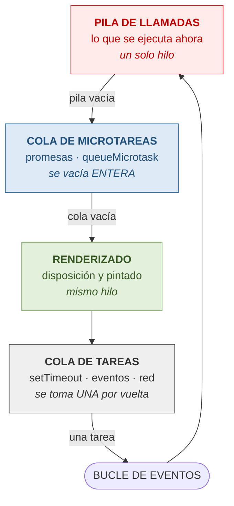

## Figura 3.4 — El orden de vaciado

La figura debe hacer visible la asimetría: **todas** las microtareas contra **una
sola** tarea. Ese contraste es el contenido.

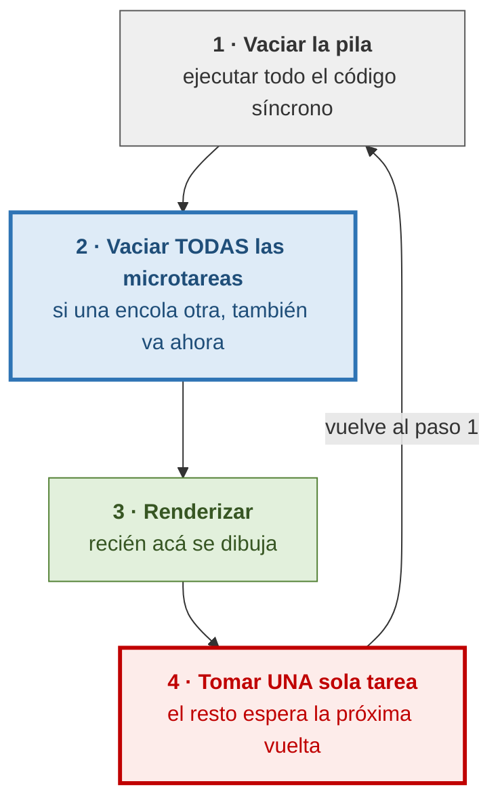

## Figura 3.5 — La cadena de prototipos

La flecha punteada de la búsqueda es lo importante: recorre la cadena **en tiempo
de ejecución**, cada vez, hasta encontrar la propiedad o llegar a `null`.

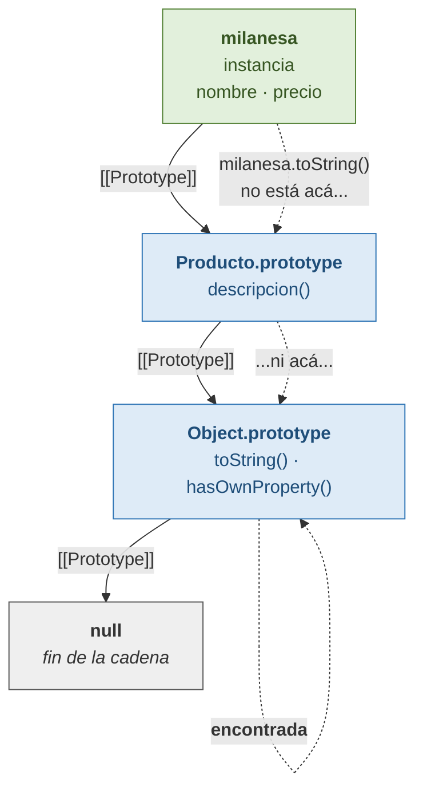

## Figura 4.1 — El árbol de nodos

Los nodos de texto van en otro color: son el punto de la figura. El `<ul>` tiene
cinco hijos, no dos, y eso explica por qué `childNodes` y `children` no coinciden.

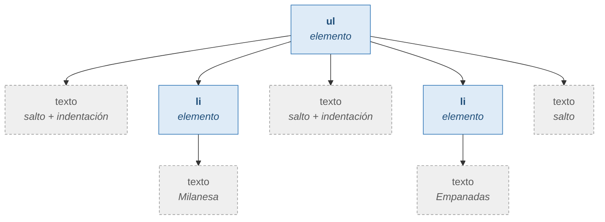

## Figura 4.2 — Las tres fases de propagación

Un solo clic recorre el árbol **dos veces**. Ese es el compromiso entre Netscape y
Microsoft que el W3C adoptó entero.

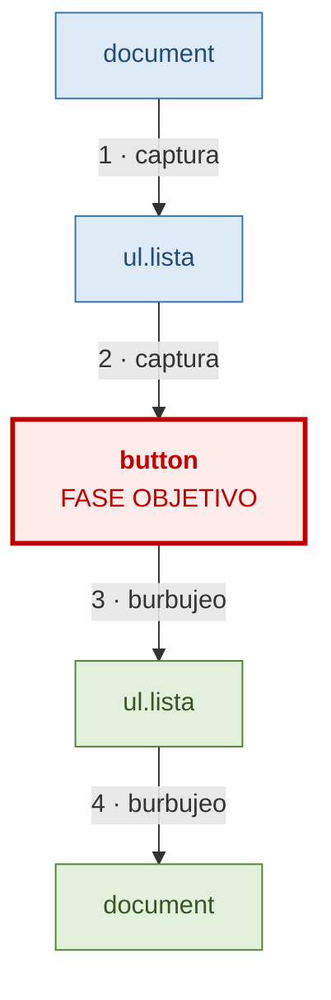

## Figura 4.3 — Delegación frente a un manejador por elemento

Las anotaciones sobre qué pasa al agregar un botón nuevo son tan importantes como
los números.

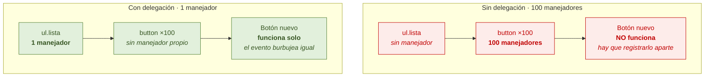

## Figura 4.4 — Cómo una clausura mantiene vivo un nodo removido

La zona del documento y la zona de memoria van separadas: el nodo salió de la
primera y sigue en la segunda. Esa es toda la figura.

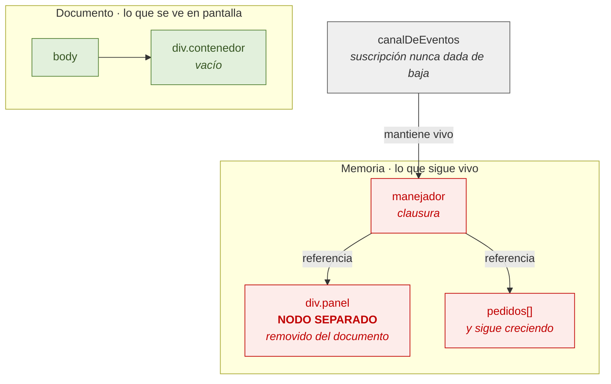

## Figura 5.1 — Estados de una promesa

Las flechas van en un solo sentido y no hay vuelta atrás: una promesa resuelta es
un valor, no una operación en curso.

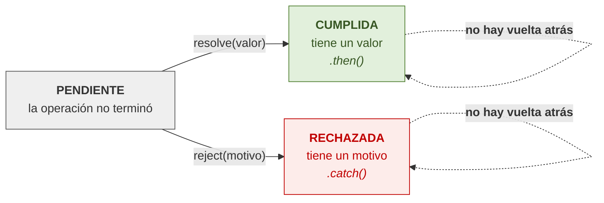

## Figura 5.2 — Cuándo `fetch` rechaza y cuándo cumple

Esta es la figura que previene el error más frecuente del capítulo. La columna de
la derecha tiene que sorprender: **404 y 500 cumplen la promesa.**

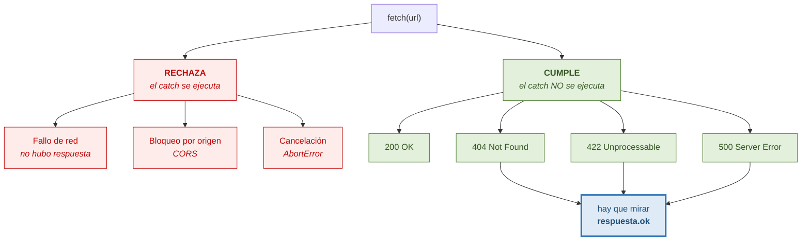

## Figura 5.3 — La verificación previa de CORS

Dos peticiones donde el código escribió una. Y si la primera falla, la segunda no
existe: el servidor nunca se entera.

```mermaid
sequenceDiagram
    participant C as Código
    participant N as Navegador
    participant S as Servidor
    C->>N: fetch(url, {method:"POST", headers:{Authorization}})
    Note over N: JSON + encabezado propio<br/>→ requiere verificación
    N->>S: OPTIONS /api/v1/pedidos
    Note right of N: Access-Control-Request-Method: POST<br/>Access-Control-Request-Headers: authorization
    S-->>N: 204 + Access-Control-Allow-*
    Note over N: sólo si autoriza,<br/>se emite la real
    N->>S: POST /api/v1/pedidos
    S-->>N: 201 Created
    N-->>C: respuesta
```

## Figura 5.4 — El hueco de la reconexión

El tramo perdido va marcado en rojo. Lo que la figura tiene que dejar claro es que
la recuperación la resuelve **el servidor**, no el navegador.

```mermaid
sequenceDiagram
    participant F as Frontend
    participant S as Servidor
    F->>S: GET /eventos (sin Last-Event-ID)
    S-->>F: evento de sincronización inicial
    S-->>F: id:1041 pedido_actualizado
    Note over F,S: ✂ se cae la conexión
    Note right of S: id:1042 · id:1043 · id:1044<br/>publicados y NO recibidos
    F->>S: reconecta con Last-Event-ID: 1041
    Note over S: busca los eventos<br/>posteriores a 1041
    S-->>F: id:1042 · id:1043 · id:1044
    Note over F,S: si el hueco es muy grande,<br/>el servidor manda "resync"<br/>y el cliente recarga todo
```


## Figura 6.1 — Del `.ts` al `.js`: el borrado

La flecha de abajo es la que importa: **el JavaScript se emite igual aunque la
verificación haya encontrado errores.** Verificación y emisión son independientes.

```mermaid
flowchart TB
    TS["<b>archivo.ts</b><br/>function subtotal(<br/>&nbsp;&nbsp;precio: number,<br/>&nbsp;&nbsp;cantidad: number<br/>): number"]
    TS --> V["<b>1 · Verificación</b><br/>analiza las anotaciones<br/><i>emite un informe</i>"]
    TS --> E["<b>2 · Emisión</b><br/>quita las anotaciones"]
    V --> INF["errores de tipo<br/><i>en la consola</i>"]
    E --> JS["<b>archivo.js</b><br/>function subtotal(<br/>&nbsp;&nbsp;precio,<br/>&nbsp;&nbsp;cantidad<br/>)"]
    INF -.->|"<b>NO detiene la emisión</b>"| JS

    classDef fuente fill:#DEEBF7,stroke:#2E74B5,color:#1F4E79
    classDef paso fill:#EFEFEF,stroke:#595959,color:#333333
    classDef aviso fill:#FDECEA,stroke:#C00000,color:#C00000
    classDef salida fill:#E2F0DC,stroke:#538135,color:#375623
    class TS fuente
    class V,E paso
    class INF aviso
    class JS salida
```

## Figura 6.2 — Tipado estructural frente a nominal

Misma forma, distinto nombre. Lo que en TypeScript compila, en un lenguaje nominal
es un error — y esa diferencia sale del modelo de objetos del Capítulo 3.

```mermaid
flowchart TB
    subgraph TSC["TypeScript · ESTRUCTURAL"]
        A1["interface Punto<br/>{ x: number; y: number }"]
        A2["interface Coordenada<br/>{ x: number; y: number }"]
        A1 -->|"const c: Coordenada = p<br/><b>compila</b>"| A2
    end
    subgraph NOM["Java / C# · NOMINAL"]
        B1["class Punto<br/>{ int x; int y; }"]
        B2["class Coordenada<br/>{ int x; int y; }"]
        B1 -->|"Coordenada c = p<br/><b>error de compilación</b>"| B2
    end

    classDef ok fill:#E2F0DC,stroke:#538135,color:#375623
    classDef no fill:#FDECEA,stroke:#C00000,color:#C00000
    class A1,A2 ok
    class B1,B2 no
```

## Figura 6.3 — El estrechamiento de una unión discriminada

Dentro de cada rama el compilador sabe exactamente qué propiedades existen. El
`default` con `never` va destacado: es la red que avisa cuando se agrega un estado.

```mermaid
flowchart TB
    U["<b>type Resultado</b><br/>tres formas con la misma<br/>propiedad discriminante"]
    U --> S{"switch (r.estado)"}
    S -->|"&quot;cargando&quot;"| C["sólo existe<br/><b>r.estado</b>"]
    S -->|"&quot;exito&quot;"| E["existe además<br/><b>r.pedidos</b>"]
    S -->|"&quot;error&quot;"| R["existe además<br/><b>r.mensaje</b>"]
    S -->|"default"| N["<b>const x: never = r</b><br/><i>falla al compilar si se<br/>agregó un caso sin contemplar</i>"]

    classDef tipo fill:#DEEBF7,stroke:#2E74B5,color:#1F4E79
    classDef rama fill:#E2F0DC,stroke:#538135,color:#375623
    classDef red fill:#FDECEA,stroke:#C00000,stroke-width:3px,color:#C00000
    class U,S tipo
    class C,E,R rama
    class N red
```

## Figura 6.4 — Dónde mienten los tipos

La línea vertical es el contenido de la figura: a la izquierda el compilador
verifica, a la derecha el programador afirma. Todo lo que entra cruza esa línea.

```mermaid
flowchart LR
    subgraph EXT["Afuera · sin verificar"]
        J["respuesta.json()<br/><i>devuelve any</i>"]
        P["JSON.parse()<br/><i>del almacenamiento</i>"]
        A["as / any<br/><i>afirmación del programador</i>"]
    end
    F["<b>EL BORDE</b><br/>acá se valida<br/>una sola vez"]
    subgraph INT["Adentro · verificado"]
        T["tipos del dominio<br/>Pedido · Producto · EstadoPedido"]
        V["vistas y lógica<br/><i>el compilador ayuda de verdad</i>"]
        T --> V
    end
    J --> F
    P --> F
    A --> F
    F --> T

    classDef fuera fill:#FDECEA,stroke:#C00000,color:#C00000
    classDef borde fill:#DEEBF7,stroke:#2E74B5,stroke-width:3px,color:#1F4E79
    classDef dentro fill:#E2F0DC,stroke:#538135,color:#375623
    class J,P,A fuera
    class F borde
    class T,V dentro
```


## Figura 7.1 — Del script suelto al empaquetado

Cada nodo lleva el problema que resolvía, no sólo su nombre. El último salto es el
importante: Vite no resolvió un problema nuevo, **notó que uno viejo había
desaparecido**.

```mermaid
flowchart LR
    A["<b>2005 · etiquetas en orden</b><br/>sin módulos, todo global<br/><i>el orden ES la dependencia</i>"]
    B["<b>2009 · CommonJS</b><br/>módulos reales<br/><i>síncrono: no sirve en el navegador</i>"]
    C["<b>AMD</b><br/>asincrónico para el navegador<br/><i>la comunidad partida en dos</i>"]
    D["<b>2011 · Browserify</b><br/>resolver antes de servir"]
    E["<b>2012 · Webpack</b><br/>todo es un nodo del grafo"]
    F["<b>2015 · Rollup</b><br/>eliminar lo que no se usa<br/><i>gracias a los import estáticos</i>"]
    G["<b>2020 · esbuild + Vite</b><br/>el navegador YA entiende import<br/><i>¿por qué empaquetar en desarrollo?</i>"]
    A --> B --> C --> D --> E --> F --> G

    classDef viejo fill:#EFEFEF,stroke:#595959,color:#333333
    classDef medio fill:#DEEBF7,stroke:#2E74B5,color:#1F4E79
    classDef hoy fill:#E2F0DC,stroke:#538135,stroke-width:3px,color:#375623
    class A,B,C viejo
    class D,E,F medio
    class G hoy
```

## Figura 7.2 — Vite: desarrollo frente a producción

Dos estrategias para dos problemas distintos. Las dependencias pre-procesadas
aparecen en ambos lados: se hacen una sola vez.

```mermaid
flowchart TB
    subgraph DEV["DESARROLLO · importa la velocidad de recarga"]
        D1["dependencias<br/>pre-procesadas con esbuild<br/><i>una sola vez, cacheadas</i>"]
        D2["código propio<br/><b>SIN empaquetar</b>"]
        D3["el navegador pide<br/>módulo por módulo"]
        D4["el servidor transforma<br/><b>sólo lo pedido</b>"]
        D2 --> D3 --> D4
    end
    subgraph PROD["PRODUCCIÓN · importa el tamaño y las peticiones"]
        P1["dependencias<br/>pre-procesadas"]
        P2["Rollup empaqueta todo"]
        P3["elimina lo que no se usa<br/>divide por import dinámico<br/>agrega huella al nombre"]
        P4["<b>unos pocos archivos</b>"]
        P2 --> P3 --> P4
    end

    classDef dev fill:#DEEBF7,stroke:#2E74B5,color:#1F4E79
    classDef prod fill:#E2F0DC,stroke:#538135,color:#375623
    class D1,D2,D3,D4 dev
    class P1,P2,P3,P4 prod
```

## Figura 7.3 — El ciclo de vida de un elemento personalizado

La flecha de retorno es el contenido de la figura: **mover el elemento vuelve a
disparar el ciclo**, y por eso las suscripciones se duplican si nadie las da de baja.

```mermaid
flowchart TB
    C["<b>constructor</b><br/><i>NO tocar el DOM<br/>NO leer atributos</i>"]
    CC["<b>connectedCallback</b><br/>se insertó en el documento<br/><i>acá va el trabajo real</i>"]
    AC["<b>attributeChangedCallback</b><br/>cambió un atributo observado"]
    DC["<b>disconnectedCallback</b><br/>se quitó del documento<br/><i>acá van TODAS las bajas</i>"]
    C --> CC
    CC <--> AC
    CC --> DC
    DC -->|"<b>si se mueve de lugar,<br/>vuelve a montarse</b>"| CC

    classDef ctor fill:#FDECEA,stroke:#C00000,color:#C00000
    classDef vida fill:#DEEBF7,stroke:#2E74B5,color:#1F4E79
    classDef baja fill:#E2F0DC,stroke:#538135,stroke-width:3px,color:#375623
    class C ctor
    class CC,AC vida
    class DC baja
```

## Figura 7.4 — Qué aísla el DOM en la sombra

La fila de Tailwind es la que decide la arquitectura del proyecto: **los estilos
globales no cruzan**, y las utilidades de Tailwind son estilos globales.

```mermaid
flowchart LR
    subgraph DOC["Documento principal"]
        G1["estilos globales<br/><b>Tailwind</b>"]
        G2["querySelector<br/>desde el documento"]
        G3["propiedades heredables<br/>tipografía · color"]
        G4["propiedades personalizadas<br/>--color-marca"]
        G5["contenido en ranuras"]
    end
    F{{"FRONTERA<br/>de la sombra"}}
    S["<b>Árbol en la sombra</b><br/>estilos propios aislados"]
    G1 -->|"<b>NO cruza</b>"| F
    G2 -->|"<b>NO cruza</b>"| F
    G3 -->|"sí cruza"| F
    G4 -->|"sí cruza"| F
    G5 -->|"se proyecta"| F
    F --> S

    classDef no fill:#FDECEA,stroke:#C00000,color:#C00000
    classDef si fill:#E2F0DC,stroke:#538135,color:#375623
    classDef borde fill:#DEEBF7,stroke:#2E74B5,stroke-width:3px,color:#1F4E79
    class G1,G2 no
    class G3,G4,G5 si
    class F,S borde
```


## Figura 8.1 — Por tipo frente a por funcionalidad

Lo que la figura tiene que hacer evidente: a la izquierda, para tocar el carrito hay
que abrir cinco carpetas; a la derecha, una. Y borrarlo es borrar esa una.

```mermaid
flowchart TB
    subgraph T["Por TIPO de archivo"]
        direction TB
        T1["components/"]
        T2["services/"]
        T3["store/"]
        T4["types/"]
        T5["utils/"]
        TC["<b>tocar el carrito</b><br/><i>= abrir las cinco</i>"]
        T1 -.-> TC
        T2 -.-> TC
        T3 -.-> TC
        T4 -.-> TC
        T5 -.-> TC
    end
    subgraph F["Por FUNCIONALIDAD"]
        direction TB
        F1["features/carrito/<br/>ui/ · service.ts"]
        F2["features/catalogo/"]
        F3["features/pedidos/"]
        FC["<b>tocar el carrito</b><br/><i>= abrir una</i><br/><b>borrarlo</b> = borrar una"]
        F1 --> FC
    end

    classDef malo fill:#FDECEA,stroke:#C00000,color:#C00000
    classDef bueno fill:#E2F0DC,stroke:#538135,color:#375623
    class T1,T2,T3,T4,T5,TC malo
    class F1,F2,F3,FC bueno
```

## Figura 8.2 — Las capas y la dirección de las dependencias

Las flechas van en un solo sentido. Las dos prohibiciones —hacia arriba y en
horizontal entre features— van tachadas en rojo: son el contenido de la figura.

```mermaid
flowchart TB
    A["<b>Arranque</b> · app/main.ts"]
    R["<b>Router</b> · app/router.ts"]
    V["<b>Vistas</b> · pages/&lt;n&gt;/index.ts"]
    FA["<b>Feature A</b><br/>ui/ · service.ts"]
    FB["<b>Feature B</b><br/>ui/ · service.ts"]
    S["<b>Stores</b> · <b>Cliente API</b> · <b>Cliente de eventos</b>"]
    TY["<b>Types</b> · sin lógica, sin imports"]
    E["<b>api/eventos.ts</b><br/><i>TRANSVERSAL</i><br/>recibe datos sin pedirlos<br/>traduce evento → invalidación"]

    A --> R --> V
    V --> FA
    V --> FB
    FA --> S
    FB --> S
    S --> TY
    FA -.->|"<b>PROHIBIDO</b><br/>horizontal"| FB
    S -.->|"<b>PROHIBIDO</b><br/>hacia arriba"| V
    E -.->|"invalida claves"| S

    classDef capa fill:#DEEBF7,stroke:#2E74B5,color:#1F4E79
    classDef base fill:#E2F0DC,stroke:#538135,color:#375623
    classDef trans fill:#EFEFEF,stroke:#595959,stroke-dasharray:5 5,color:#333333
    class A,R,V,FA,FB capa
    class S,TY base
    class E trans
```

## Figura 8.3 — Estado del cliente frente a estado del servidor

La pregunta del medio es la figura. `CartItem` va sobre la línea: es la única
excepción declarada a RN-F03.

```mermaid
flowchart TB
    Q{{"¿Quién es el dueño<br/>de este dato?"}}
    Q -->|"el servidor<br/><i>yo tengo una copia</i>"| SRV["<b>QueryClient</b><br/>productos · pedidos · stock<br/><i>puede quedar vieja</i><br/><i>se invalida y recarga</i>"]
    Q -->|"sólo existe acá"| CLI["<b>Stores</b><br/>authStore · cartStore · uiStore<br/>filterStore · checkoutStore · eventosStore<br/><i>nadie más lo cambia</i>"]
    CI["<b>CartItem</b><br/>nombre y precio_ref<br/><i>copia de exhibición</i><br/><b>excepción declarada a RN-F03</b><br/>se revalida al montar el carrito"]
    SRV -.-> CI
    CLI -.-> CI

    classDef pregunta fill:#DEEBF7,stroke:#2E74B5,stroke-width:3px,color:#1F4E79
    classDef srv fill:#EFEFEF,stroke:#595959,color:#333333
    classDef cli fill:#E2F0DC,stroke:#538135,color:#375623
    classDef exc fill:#FDECEA,stroke:#C00000,color:#C00000
    class Q pregunta
    class SRV srv
    class CLI cli
    class CI exc
```

## Figura 8.4 — Los siete pasos del arranque

El paso 2 va destacado: mostrar carga **y nunca login** es lo que evita el parpadeo
en cada recarga. El canal se abre último, recién en el paso 7.

```mermaid
flowchart TD
    P1["<b>1</b> · Lee el estado persistido"]
    P1 -->|"sin token"| SIN["rehidratación terminada<br/>sesión anónima<br/><b>sin abrir canal</b>"]
    P1 -->|"con token"| P2["<b>2</b> · Muestra ESTADO DE CARGA<br/><b>nunca la vista de login</b> · RN-F06<br/>y pide GET /auth/me"]
    P2 -->|"200"| P3["<b>3</b> · Completa usuario<br/>termina la rehidratación"]
    P2 -->|"401"| P4["<b>4</b> · Limpia authStore<br/>termina como anónima<br/><b>no abre el canal</b>"]
    P3 --> P5["<b>5</b> · Recién ahora el Router<br/>resuelve la ruta y monta la vista"]
    SIN --> P5
    P4 --> P5
    P5 --> P6["<b>6</b> · Precarga en paralelo<br/>catálogo y árbol de categorías"]
    P6 --> P7["<b>7</b> · Si hay sesión, abre el<br/><b>ÚNICO</b> EventSource · RN-F10<br/>con el último id persistido"]

    classDef paso fill:#DEEBF7,stroke:#2E74B5,color:#1F4E79
    classDef clave fill:#FDECEA,stroke:#C00000,stroke-width:3px,color:#C00000
    classDef fin fill:#E2F0DC,stroke:#538135,color:#375623
    class P1,P3,P5,P6,SIN,P4 paso
    class P2 clave
    class P7 fin
```

## Figura 8.5 — El ciclo de vida de la clave de idempotencia

Los tres momentos marcados en rojo son tres bugs distintos, y los tres terminan en
un pedido duplicado y un doble cargo.

```mermaid
flowchart TD
    A["Usuario entra al<br/><b>último paso del checkout</b>"]
    B["<b>crypto.randomUUID()</b><br/>se genera acá<br/><i>NO al confirmar</i>"]
    C["se persiste en checkoutStore<br/><i>sobrevive a una recarga</i>"]
    D["viaja en el encabezado<br/><b>Idempotency-Key</b>"]
    E{"¿llegó la respuesta?"}
    F["reintento con<br/><b>la misma clave</b><br/><i>el servidor reconoce el reenvío</i>"]
    G["<b>onSuccess</b><br/>recién acá se descarta"]
    A --> B --> C --> D --> E
    E -->|"no · corte de red"| F --> D
    E -->|"sí · 201"| G

    classDef normal fill:#DEEBF7,stroke:#2E74B5,color:#1F4E79
    classDef critico fill:#FDECEA,stroke:#C00000,stroke-width:3px,color:#C00000
    classDef fin fill:#E2F0DC,stroke:#538135,color:#375623
    class A,D,E normal
    class B,C,F critico
    class G fin
```
